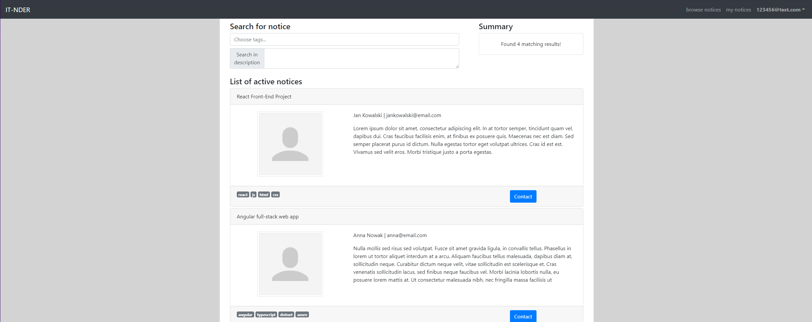
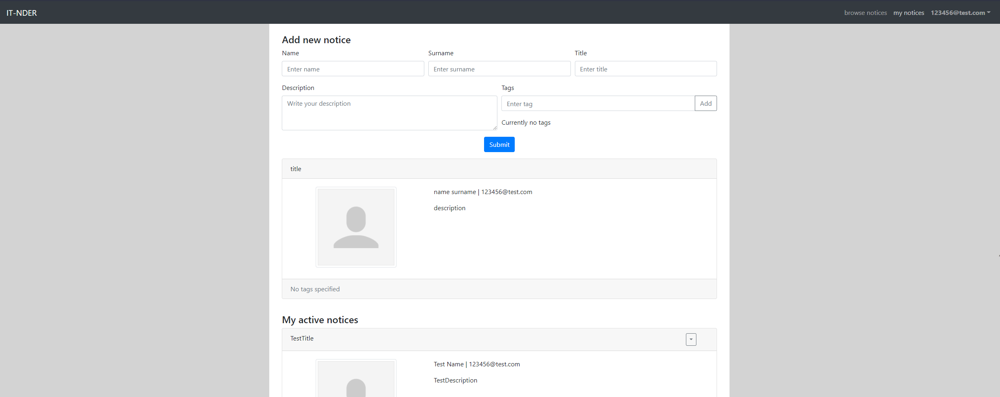

# IT-NDER v3

> Demo website project for students looking for IT projects teammates.

## Table of contents

- [IT-NDER v3](#it-nder-v3)
  - [Table of contents](#table-of-contents)
  - [General info](#general-info)
  - [Demo](#demo)
  - [Screenshots](#screenshots)
  - [Technologies](#technologies)
  - [Features](#features)
  - [Issues](#issues)
  - [Status](#status)
  - [Contact](#contact)

## General info

This demo website was created as an exercise in React and React Bootstrap tools. The main focus was on creating fully responsive, mobile friendly web application. In the third iteration a Firebase backend has been added.

## Demo

Project is available online on Github Pages [here](https://michaltkacz.github.io/it-nder/).

## Screenshots

todo

## Technologies

- HTML / CSS / JS
- [React 17.0.2](https://reactjs.org/) library.
- [React Bootstrap v1.5.2](https://react-bootstrap.github.io/) front-end library.
- [Bootstrap v5.0.0](https://getbootstrap.com/) front-end toolkit.
- [Firebase](https://firebase.google.com/) service as backend for authorization and database.

## Features

List of features:

- Mobile and desktop friendly
- Realtime Database.
- Account authorization
- Add, remove, edit own notice.
- Browse other notices.
- Dynamic notices filtering by tags and description keywords.

## Issues

No major issuses spotted.

## Status

This is the third and the last one iteration of the project. It will be no longer developed.

## Contact

Created by [@michaltkacz](https://github.com/michaltkacz) - feel free to contact me!
