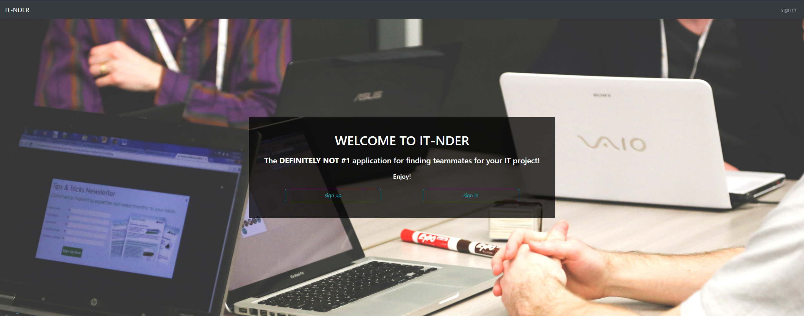

# IT-NDER v3

> Demo website project for students looking for IT projects teammates.

## Table of contents

- [IT-NDER v3](#it-nder-v3)
  - [Table of contents](#table-of-contents)
  - [General info](#general-info)
  - [Demo](#demo)
  - [Screenshots](#screenshots)
  - [Technologies](#technologies)
  - [Setup and run](#setup-and-run)
  - [Features](#features)
  - [Issues](#issues)
  - [Status](#status)
  - [Contact](#contact)

## General info

This demo website was created as an exercise in React and React Bootstrap tools. The main focus was on creating fully responsive, mobile friendly web application. In the third iteration a Firebase backend has been added.

## Demo

Project is available online on Github Pages [here](https://michaltkacz.github.io/it-nder/).

## Screenshots

todo

<!--  -->

## Technologies

- HTML / CSS / JS
- [React Bootstrap v1.5.2](https://react-bootstrap.github.io/ 'React Bootstrap page') front-end library.
- [Bootstrap v5.0.0](https://getbootstrap.com/ 'Bootstrap page') front-end toolkit.
- [react-bootstrap-typeahead v5.1.4](https://github.com/ericgio/react-bootstrap-typeahead 'react-bootstrap-typeahead page') library.
- [Firebase](https://firebase.google.com/) service as backend for authorization and database.

## Setup and run

To run it locally, download the repository and run `npm install` in project root folder. Then launch `npm start` to start project on local server.

## Features

List of features:

- Register and login.
- Add, remove, edit notice.
- Dynamic notices filtering by tags and description keywords.
- Responsive website - mobile friendly.
- Realtime Database.

## Issues

No major issuses spotted.

## Status

This is the third iteration of the project. It will probably be under further development.

## Contact

Created by [@michaltkacz](https://github.com/michaltkacz) - feel free to contact me!
